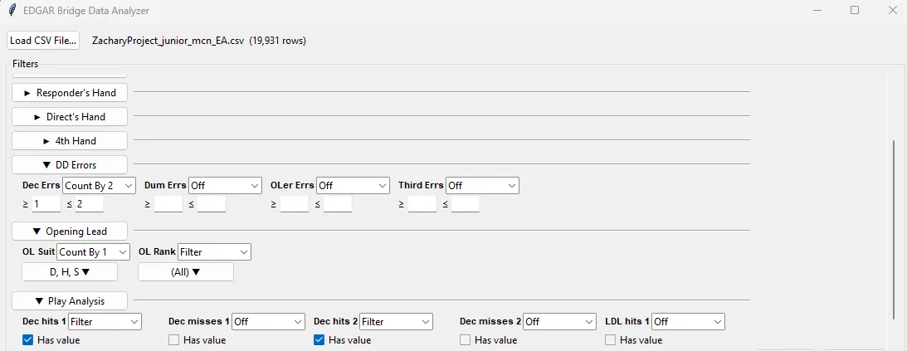
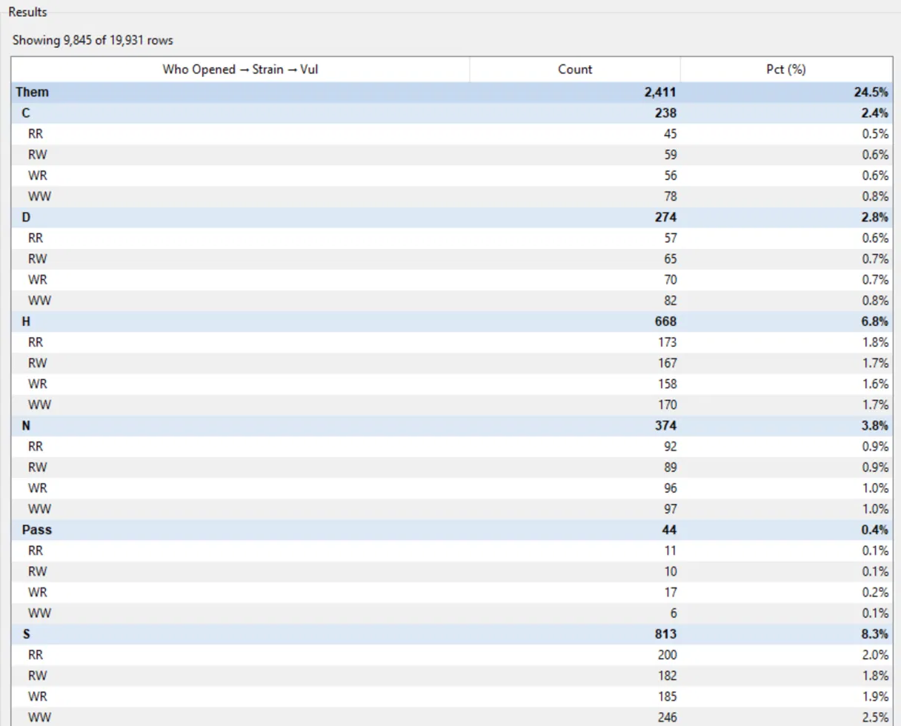

# Bridge-Cheat-Detector-UI
Writeup: desktop tool for screening sanctioned online bridge play, implementing The EDGAR Association's published cheat-detection methodology. Built under an ACBL agreement, shipped and in active use since February 2026.
 
## What it does
 
Loads a per player hand export, derives the columns that the methodology requires, and gives a reviewer a way to filter, group, and count across the columns.
 
The reviewers are bridge experts, and previously they would manually search the data in a spreadsheet, which was difficult and inefficient to use. The goal was to create a ui that would allow them to derive the same information from the same spreadsheet, but in a significantly easier to use manner.

Requirements came from direct iteration with a bridge expert on the reviewing side, and outputs were validated against previously adjudicated cases before handoff. 
 
## Build
 
Single file Python application, tkinter for the UI, pandas for the data work, Pyinstaller for bundling.
 
- **Data-driven filter surface.** Each analytic dimension is one entry in a declarative registry, and the controls and their behavior are generated from it. Adding or changing a dimension is a data change, not a UI rewrite, which is useful since the requirements kept moving.
- **Three control types rather than one per field.** Multi-select, numeric range, presence. Every dimension maps onto one of them.
- **Interactive pivoting.** Any dimension can be promoted to a grouping key, stacked up to three deep, producing a hierarchical breakdown with counts and percentages.
- **Single Windows executable (~38 MB).** No Python install, no dependencies, no setup, and the data stays local. Deliberately a desktop tool rather than a web service — there's no infrastructure for the user to stand up or maintain. The cost is platform reach, which was an acceptable trade for a clean handoff to a non-technical user.

## Scale
 
Player exports run 10,000 - 30,000+ rows of hands, drawn from a decade or more of play history. The tool loads that in one pass and keeps filtering and pivoting responsive enough to work through a case in one sitting.
 
## Source
 
Private, since the tool implements a licensed third-party methodology, and publishing what it measures would make the method easier to evade. This README covers the engineering and omits the detection logic.

## Screenshots
 

